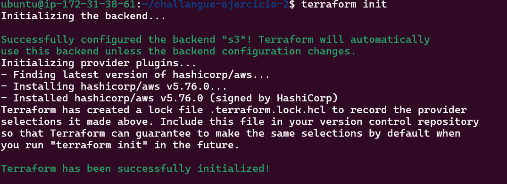
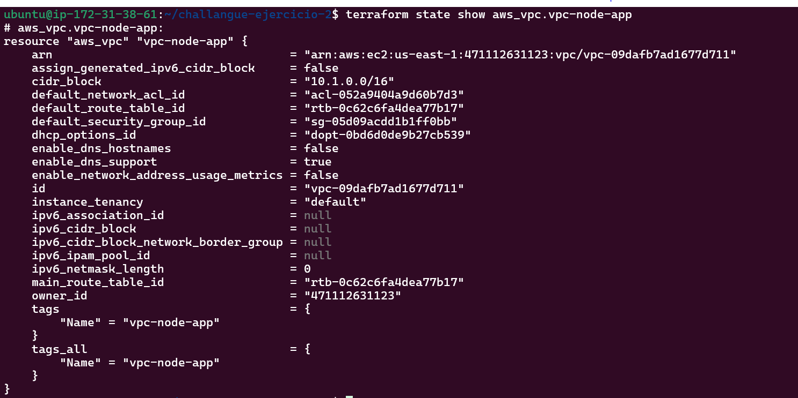

## EJ 2 - Implementecion de Terraform con estado remoto y migración de recursos

El equipo quiere empezar a utilizar terraform, para esto necesita guardar el estado de terraform en AWS, entonces necesitaremos todos los componentes para guardar estos estados. El proceso debe ser documentado para poder replicarse en otras cuentas.
Tambien el equipo tiene recursos que necesita exportar a IaC, entre ellos IAM Roles, VPC y S3 buckets(no perder contenido).
Lista de recursos a importar de la cuenta #471112631123 us-east-1 :
 - VPC: vpc-node-app
 - IAM Role: role-node-app
 - S3 Bucket: node-app-backup


## Como desplegar.

```bash
git clone https://github.com/Full-Juan-Ortega/challangue-ejercicio-2 && \
cd challangue-ejercicio-2 && \
terraform init && \
terraform plan && \
terraform apply -auto-approve
```


## Preparacion : 

Instalar [AWS-CLI oficial](https://docs.aws.amazon.com/cli/latest/userguide/getting-started-install.html) :  
```bash
sudo apt install unzip && \
sudo curl "https://awscli.amazonaws.com/awscli-exe-linux-x86_64.zip" -o "awscliv2.zip" && \
sudo unzip awscliv2.zip && \
sudo ./aws/install && \
sudo rm -rf awscliv2.zip aws
```
Instalar [terraform oficial](https://developer.hashicorp.com/terraform/install?product_intent=terraform#linux) :  
```bash
sudo apt update && \
sudo apt install -y wget gnupg lsb-release software-properties-common && \
wget -O- https://apt.releases.hashicorp.com/gpg | gpg --dearmor -o /usr/share/keyrings/hashicorp-archive-keyring.gpg --yes && \
echo "deb [signed-by=/usr/share/keyrings/hashicorp-archive-keyring.gpg] https://apt.releases.hashicorp.com $(lsb_release -cs) main" | sudo tee /etc/apt/sources.list.d/hashicorp.list && \
sudo apt update && \
sudo apt install -y terraform
```

## Paso a paso : 

### 1 - Conectarse a aws.

Configure las credenciales con `aws configure`.  
Verifique usuario : `aws sts get-caller-identity #verificar login.`

### 2 - Guardar el estado de terraform en un bucket de aws.

Cree el [bucket juan-ej02](https://us-east-1.console.aws.amazon.com/s3/buckets/juan-ej02?region=us-east-1&bucketType=general&prefix=./&showversions=false) y lo asigne como mi backend en [s3-backend.tf](s3-backend.tf).



```bash
terraform init
terraform apply
terraform init
```

### 3 - Importar VPC , S3 y IAM ROLE: 

[Use este ejemplo de la documentacion oficial para importar los recursos.](https://registry.terraform.io/providers/hashicorp/aws/latest/docs/resources/vpc#import)

  - **VPC: vpc-node-app:**  

    En [vpc-node-app.tf](vpc-node-app.tf) genere el recurso vacio.  

    - Busque el id de la vpc en aws.  
    - Hice el import.  
    - Luego con el terraform state importe las propiedades :

    - 

    ```bash
    terraform import aws_vpc.vpc-node-app <id de la vpc>
    terraform state show y copiar las propiedades.
    ```
    

  - **IAM : role-node-app**

    En [role-node-app.tf](role-node-app.tf) genere el recurso vacio.

    Busque el id del rol : (no pude verlo atraves de ui de aws ).
    ``aws iam get-role --role-name role-node-app --query 'Role.RoleId' --output text`
    En este recurso prove creando el recurso y luego importandolo pero no me dejo , vi la doc oficial y decia que debia crear un bloque para importar.

    ```
    import {
      to = aws_iam_role.role-node-app
      id = "role-node-app"
    }
    ```	
    Ya con esto pude realizar el mismo procedimiento que con la vpc.

  - **S3 Bucket: node-app-backup**

    En [backup-node-app-s3.tf](backup-node-app-s3.tf) genere el recurso vacio.

    Mismo proceso que la vpc, manualmente hice algunos ajustes en la importacion por diferencia al ver el plan.

